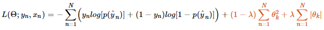

<h2>MachineLearning-LogisticRegressionWithGradientAscentOrNewton</h2>
<h3>Description:</h3>
<ul style="list-style-type:disc">
	<li>Python script to estimate coefficients for Logistic regression using either Gradient Ascent or Newton-Raphson optimisaiton algorithm. Further can choose none/one/both of Ridge and LASSO regularisation. </li>
	<li>Logistic regression implemented from scratch.</li>
	<li>Using the Iris dataset available in sklearn, which contains characteristics of 3 types of Iris plant and is a common dataset when experimenting with data analysis. To learn more about the dataset, click <a href="https://archive.ics.uci.edu/ml/datasets/iris">here</a>.</li>
</ul>

  
  

  
  

 

<h3>Model:</h3>
Estimate Logistic equation

Where  is given by

And estimates are trained using optimisation of the conditional maximum Likelihood (cost) function

using either Gradient Ascent or Newton-Raphson methods.
 
<h4>Gradient Ascent</h4> 
The parameter iterative updates are calculated as

<h4>Newton-Raphson</h4> 

The parameter iterative updates are calculated as

Convergence is reached when either the tolerance level on the cost function has been reached

 or the full Hessian is no longer invertible or the maximum number of iterations has been exceeded.
 
 
<h4>Regularisation</h4> 

None, either or both LASSO (least absolute shrinkage and selection operator) Regression (L1) or Ridge Regression (L2) are implemented using the mixing parameter . Where Ridge  and Lasso .

 
<h3>Decision Boundary</H3>
The linear decision boundary shown in the figures results from setting the target variable to zero and rearranging equation (1). ie.

 
<h3>How to use</h3>
<pre>
python logisticRegression.py
</pre>
		
		
<h3>Expected Output</h3>
<pre>
 Iteration #:        1.  Cost: +0.2190
 Iteration #:        2.  Cost: +0.1058
 Iteration #:        3.  Cost: +0.0554
 Iteration #:        4.  Cost: +0.0301
 Iteration #:        5.  Cost: +0.0166
 Iteration #:        6.  Cost: +0.0091
 Iteration #:        7.  Cost:    +nan.
 Finished because singular Hessian. Using newton optimisation method.
 ================================================================================
 LOGISTIC REGRESSION USING NEWTON TERRMINATION RESULTS
 ================================================================================
 Initial Weights were:             0.0, 0.0, 0.0.
 With initial cost:       +0.693147.
 # Iterations:              +7.    
 Final weights:    theta0:-25.51, theta1:+11.25, theta02:-11.283.
 Final cost:       +0.009061.
 ================================================================================

	Iteration #:   10,000.  Cost: +0.0343
	Iteration #:   20,000.  Cost: +0.0288
	Iteration #:   30,000.  Cost: +0.0257
	Iteration #:   40,000.  Cost: +0.0234
	Iteration #:   50,000.  Cost: +0.0215
	Iteration #:   60,000.  Cost: +0.0199
	Iteration #:   70,000.  Cost: +0.0185
	Iteration #:   80,000.  Cost: +0.0173
	Iteration #:   88,543.  Cost: +0.0164.
 	Finished because cost function tolerance reached. Using gradientAscent optimisation method.
	================================================================================
	LOGISTIC REGRESSION USING GRADIENTASCENT TERRMINATION RESULTS
	================================================================================
	Initial Weights were:             0.0, 0.0, 0.0.
   	With initial cost:       +0.693147.
	# Iterations:         +88,543.    
	Final weights:    theta0:-13.42, theta1:+9.09, theta02:-11.539.
	Final cost:       +0.016394.
	================================================================================

	================================================================================
	LOGISTIC REGRESSION USING SKLEARN TERMINATION RESULTS
	Final weights:    theta0:-80.54, theta1:+31.59, theta2:-28.30.
	================================================================================

	Finished
</pre>

<h3>Highlights</h3>
<ul style="list-style-type:disc">
	<li>Newton-Raphson optimisation clearly locates coefficients in far less iteration steps than Gradient Ascent.</li>
	<li>Logistic regression is a powerful classification tool in machine learning.<li>

<h3>Requirements</h3>
 
<a href="https://www.python.org/">Python (>2.7)</a>, <a href="http://www.numpy.org/">Numpy</a> and <a href="https://scikit-learn.org/stable/">Scikit-Learn</a>.

 
 
 
 
