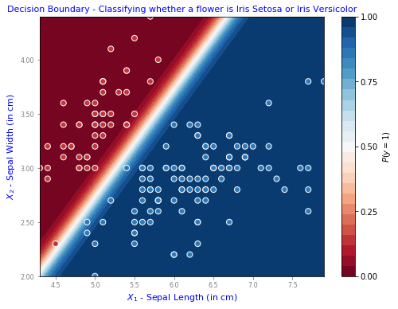
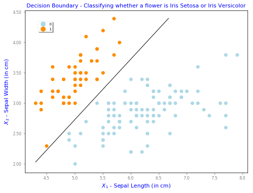
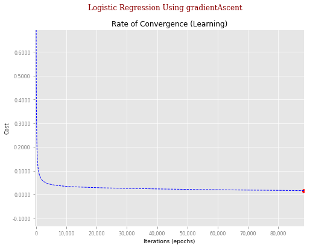
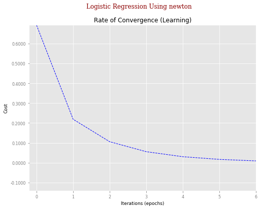

<h2>MachineLearning-LogisticRegressionWithGradientAscentOrNewton</h2>
<h3>Description:</h3>
<ul style="list-style-type:disc">
	<li>Python script to estimate coefficients for Logistic regression using either gradient descent or Newton algorithm and regularisation . </li>
	<li>Logistic regression implemented from scratch.</li>
	<li>Using the Iris dataset available in sklearn, it contains characteristics of 3 types of Iris plant and is a common dataset when experimenting with data analysis. To learn more about the dataset, click <a href="https://archive.ics.uci.edu/ml/datasets/iris">here</a>.</li>
</ul>

<table style="max-width:100%;white-space:nowrap;">
	<tr>	
		<th>	    
			
		</th>
		<th>	    
			
		</th>
	</tr>
	
	<tr>	
		<th>	    
			
		</th>
		<th>	    
			
		</th>
	</tr>
	
</table>
  

<h3>Model:</h3>
Estimate Logistic equation

$$
   p(\hat{y}) = \frac{1}{1+e^{-\hat{y}}}
$$

Where $\hat{y}$ is given by 

$$
	\begin{equation}\label{eq:Hypothesis}
		\hat{y} = \Theta^T X + \epsilon = \theta_0 + \theta_1 x_1 + \theta_2 x_2 = \theta_0 + \theta_1 \text{SepalLength} +  \theta_2 \text{SepalWidth}
	\end{equation}
$$

And estimates located using optimisation of the conditional maximum Likelihood function

$$	
	L(\Theta ; y_n,x_n) = -\sum^{N}_{n=1}  \Bigl (  y_n log[p(\hat{y}_n)] + (1 - y_n) log[1-p(\hat{y}_n)]  \Bigr )
$$

using either Gradient Ascent or Newton-Raphson methods.
 
<h4>Gradient Ascent</h4> 
The parameter iterative updates are calculated as

$$
	\begin{align}
		\theta_{n+1} &= \theta_n + \alpha \frac{\partial L}{\partial \theta_n}   \nonumber \\
					 &= \theta_n + \alpha \sum^{N}_{n=0} \Bigl ( y_n - p(\hat{y}) \Bigr ) x_{nk} \nonumber
	\end{align}
$$

 
<h4>Newton-Raphson</h4> 

Parameter updating is given by

$$
	\begin{align}
		\theta_{n+1} 	&= \theta_n - \frac{\frac{\partial L}{\partial \theta_n}}{\frac{\partial^2 \mathcal{L}}{\partial \theta^2}} 					\nonumber \\
						&= \theta_n - \frac{\sum^{N}_{n=1} \left ( y_n - p(\hat{y}_n) \right ) x_{nk}}{-\sum^N_{i=1} X^T X p(\hat{y}) (1 - p(\hat{y}))} \nonumber \\
						&= \theta_n + \frac{\sum^{N}_{n=1} \left ( y_n - p(\hat{y}_n) \right ) x_{nk}}{\sum^N_{i=1} X^T X p(\hat{y}) (1 - p(\hat{y}))}  \nonumber
	\end{align}
$$

Convergence is reached when either the tolerance level on the cost function has been reached

$$	
		\vert \ell(\Theta,X)_{n} - \ell(\Theta,X)_{n-1} \vert \lt \gamma	
$$

or the full Hessian is no longer invertible or the maximum number of iterations has been exceeded.
 
  
<h4>Regularisation</h4>
$\hat{y}$
None, either or both LASSO $\hat{y}$ (least absolute shrinkage and selection operator) $\hat{y}$ Regression (L1) or Ridge Regression (L2) are implemented using the mixing parameter $\hat{y}$ 
$\lambda$ 
. Where Ridge $(\lambda=0)$ and Lasso $(\lambda=1)$. $\hat{y}$
 $\hat{y}$
 
$$
    	L(\Theta ; y_n,x_n) = -\sum^{N}_{n=1}  \Bigl (  y_n log[p(\hat{y}_n)] + (1 - y_n) log[1-p(\hat{y}_n)]  \Bigr )  + (1-\lambda) \sum^N_{n=1} \theta^2_k + \lambda \sum^N_{n=1} \vert \theta_k \vert
$$ 
 
 $\hat{y}$
 
<h3>Decision Boundary</H3>
The linear decision boundary shown in the figures results from setting the target variable to zero and rearranging equation (1).

$$
	\begin{align}
		x_2 &= - \frac{\theta_0 + \theta_1 x_1}{\theta_2}								\nonumber \\
		\text{SepalWidth} &= - \frac{\theta_0 + \theta_1 \text{SepalLength}}{\theta_2}  \nonumber
	\end{align}
$$

  
<h3>How to use</h3>
<pre>
python logisticRegression.py
</pre>
		
		
<h3>Expected Output</h3>
<pre>
	Iteration #:        1.  Cost: +0.2190
	Iteration #:        2.  Cost: +0.1058
	Iteration #:        3.  Cost: +0.0554
	Iteration #:        4.  Cost: +0.0301
	Iteration #:        5.  Cost: +0.0166
	Iteration #:        6.  Cost: +0.0091
	Iteration #:        7.  Cost:    +nan.
	Finished because singular Hessian. Using newton optimisation method.
	================================================================================
	LOGISTIC REGRESSION USING NEWTON TERRMINATION RESULTS
	================================================================================
	Initial Weights were:             0.0, 0.0, 0.0.
	   With initial cost:       +0.693147.
			# Iterations:              +7.    
		   Final weights:    theta0:-25.51, theta1:+11.25, theta02:-11.283.
			  Final cost:       +0.009061.
	================================================================================

	Iteration #:   10,000.  Cost: +0.0343
	Iteration #:   20,000.  Cost: +0.0288
	Iteration #:   30,000.  Cost: +0.0257
	Iteration #:   40,000.  Cost: +0.0234
	Iteration #:   50,000.  Cost: +0.0215
	Iteration #:   60,000.  Cost: +0.0199
	Iteration #:   70,000.  Cost: +0.0185
	Iteration #:   80,000.  Cost: +0.0173
	Iteration #:   88,543.  Cost: +0.0164.
	Finished because cost function tolerance reached. Using gradientAscent optimisation method.
	================================================================================
	LOGISTIC REGRESSION USING GRADIENTASCENT TERRMINATION RESULTS
	================================================================================
	Initial Weights were:             0.0, 0.0, 0.0.
	   With initial cost:       +0.693147.
			# Iterations:         +88,543.    
		   Final weights:    theta0:-13.42, theta1:+9.09, theta02:-11.539.
			  Final cost:       +0.016394.
	================================================================================

	================================================================================
	LOGISTIC REGRESSION USING SKLEARN TERMINATION RESULTS
	Final weights:    theta0:-80.54, theta1:+31.59, theta2:-28.30.
	================================================================================

	Finished
</pre>

<h3>Highlights</h3>
Newton Raphson clearly locates coefficients in far less iteration steps than Gradient Ascent.

<h3>Requirements</h3>
 
<a href="https://www.python.org/">Python (>2.7)</a>, <a href="http://www.numpy.org/">Numpy</a> and <a href="https://scikit-learn.org/stable/">Scikit-Learn</a>.

 
 
 
 
